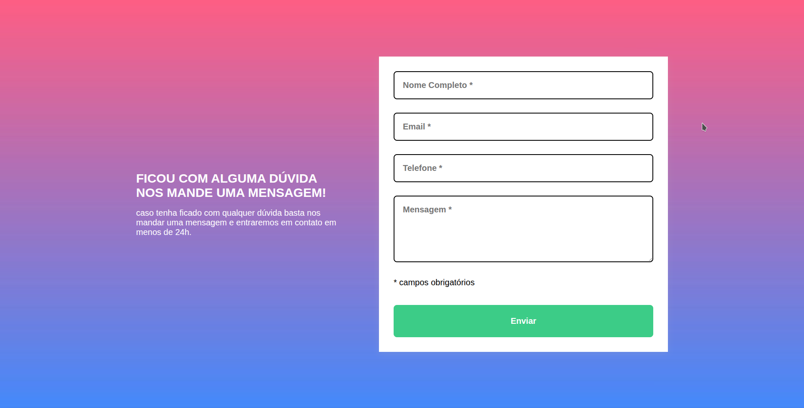

# Quest02

Este projeto é um formulário de contato responsivo, desenvolvido como parte dos estudos do curso Dev em Dobro.

## Funcionalidades

- Layout responsivo para diferentes tamanhos de tela
- Validação de campos obrigatórios
- Feedback visual para campos válidos e inválidos
- Mensagem de erro para campos não preenchidos

## Tecnologias utilizadas

- HTML5
- CSS3
- JavaScript

## Como usar

1. Clone ou baixe este repositório.
2. Abra o arquivo `index.html` na pasta `Quest` em seu navegador.
3. Preencha o formulário e clique em "Enviar".

## Estrutura dos arquivos

- `index.html` — Estrutura do formulário e informações.
- `style.css` — Estilos e responsividade.
- `index.js` — Validação dos campos do formulário.

## Demonstração

---

Desenvolvido para fins de aprendizado.